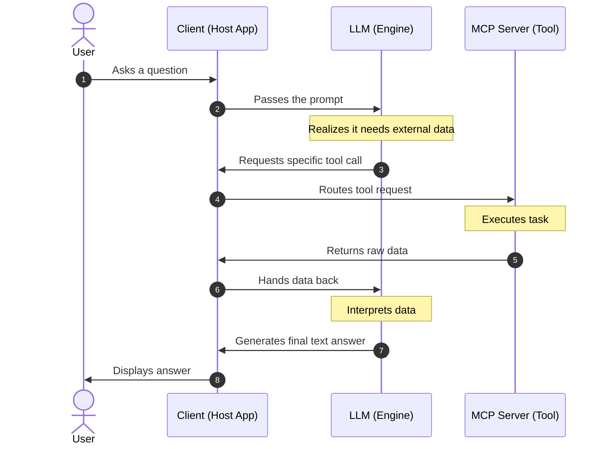

# Model Context Protocol (MCP) Architecture

In the Model Context Protocol (MCP), the **LLM itself is not the client**, but it works directly alongside it. 

Here is how the roles are broken down in an MCP architecture:

## 1. The Client (The Host Application)
* **What it is:** The software application you interact with.
* **Examples:** Claude Desktop, Cursor, VS Code, or a custom AI agent framework.
* **Role:** It maintains the user interface, manages security permissions, and hosts the LLM. It acts as the orchestrator, sitting between you, the LLM, and the tools.

## 2. The LLM (The Engine)
* **What it is:** The language model (like Claude 3.5 Sonnet).
* **Role:** It acts as the "brain" or reasoning engine. It decides when to use a tool, interprets the data returned by the server, and frames the final response for you. It does not connect to the server directly; it talks through the client.

## 3. The Server (The Tool Provider)
* **What it is:** A lightweight program that exposes specific data or capabilities.
* **Examples:** A GitHub integration server, a local Postgres database connector, or a Google Drive API bridge.
* **Role:** It executes the actual tasks (like fetching a file or running a query) and sends the raw data back to the client.

---

## Summary of the Workflow

1. **You** ask a question in the Client.
2. The **Client** passes the prompt to the LLM.
3. The **LLM** realizes it needs external data and asks the Client to call a specific tool.
4. The **Client** routes that request to the MCP Server.
5. The **MCP Server** does the work and returns the data to the Client.
6. The **Client** hands the data back to the LLM.
7. The **LLM** reads the data and generates the final answer for you.
